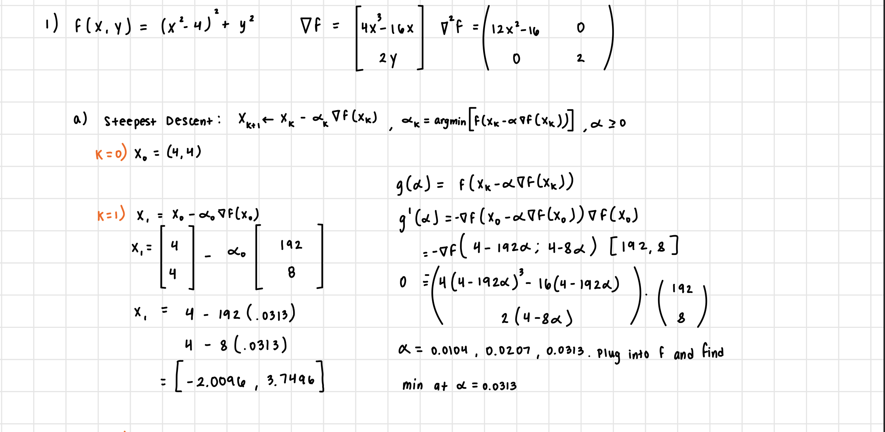
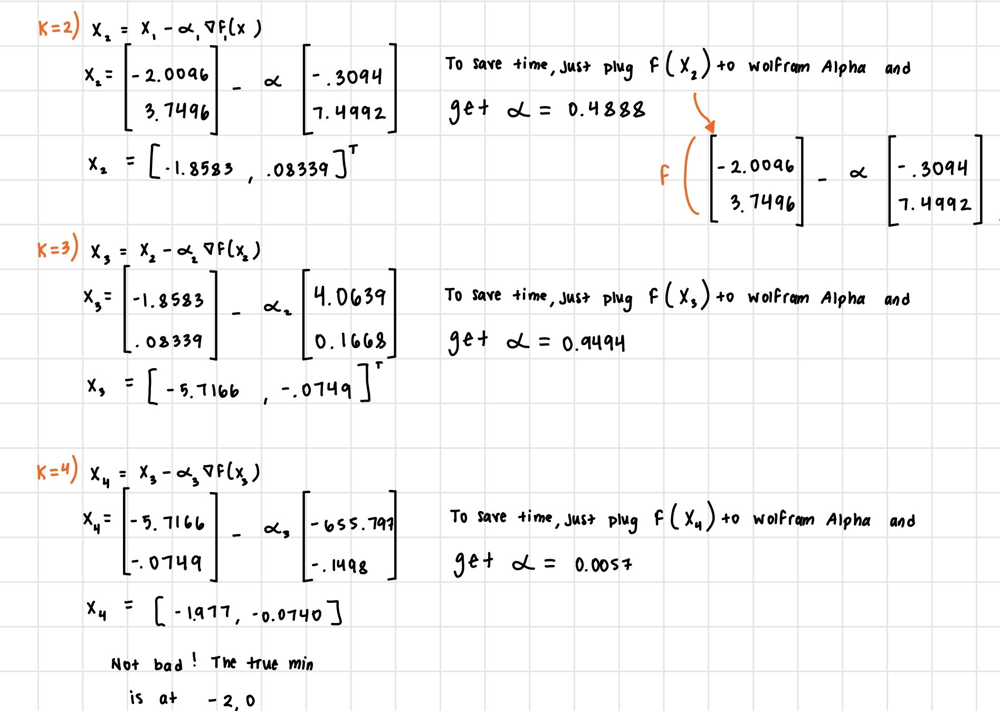
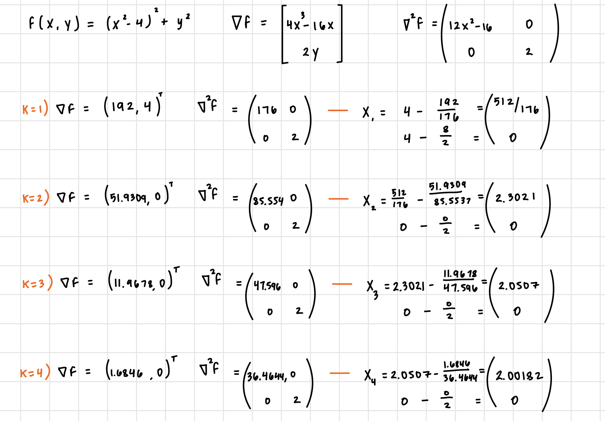
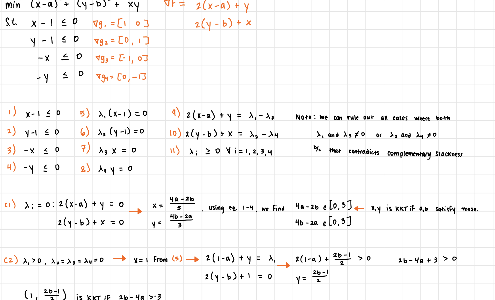
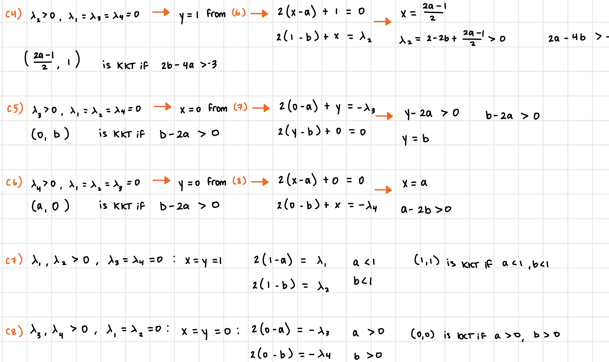
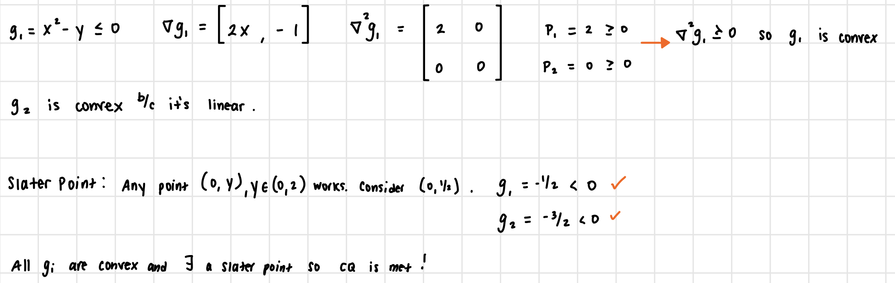
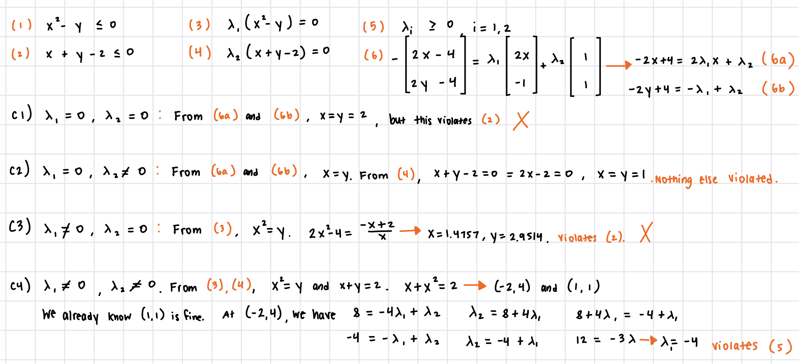
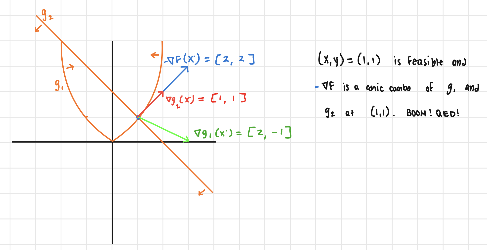
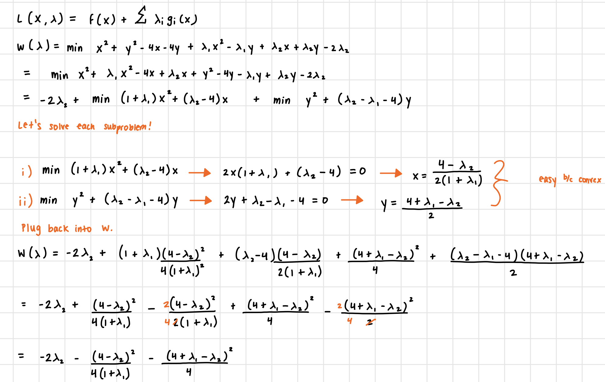
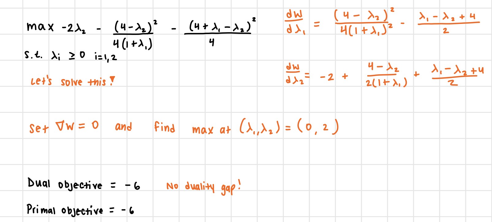

# IEOR 262A HW5

### Question \#1: 

#### (a) Steepest Descent 
Below is my implementation of gradient descent with exact line search. After the first iteration, I settled for finding the step size $\alpha$ by plugging the corresponding functions into Wolfram Alpha to find the minimum.

#### (b) Newton's Method
Below is my implementation of Newton's method. 

#### Comparison of Steepest Descent versus Newton's Method

The true minima for this function are (-2,0) and (2,0) and we see that each method approaches one of these two. Although more computationally expensive, the Newton's method approach is slightly better. Newton's method has a final objective value of 0.000053, and steepest descent has a final objective value of 0.01384, so it is clearly a few orders of magnitude worse than Newton's.

### Question \#2: 

We will check all cases using our KKT conditions, excluding cases that clearly violate complementary slackness. Each case corresponds to a condition on $a$ and $b$ such that the corresponding $(x,y)$ solution is a KKT point. 

### Question \#3: 
Here, we just check that all constraints are convex and that there exists a slater point.
#### (a) 

#### (b) 

Thus, we only have one KKT point at (1,1) so it must be the minimum.

#### (c) 
We'll first find the Lagrangian dual, noting its convexity, and find the maximum of the new unconstrained optimization problem.

We see the optimal objective of our dual is the same as plugging in our KKT point of (1,1) into the primal (ie both have value = -6). There is no duality gap! Boom!

### Exercise 5.6: 

#### (a)

 Let's define three sets of decision variables. First, let $a_i$ be the number of lamps produced by Company A in month $i, i = 0,1,2,3$ for the four months in question. Let $c_i$ be the number of lamps purchased by Company A from Company C in month $i$. Let $h_i$ be the number of lamps held in inventory in the next month.

Each month, the sum of the produced lamps, purchased lamps and held lamps must exceed the demand required. In our objective, we don't

 $$ \text{min} \quad 35(a_0+a_1+a_2+a_3) + 50(c_0+c_1+c_2+c_3) + 5(h_0+h_1+h_2+h3) \\
 \text{subject to:} \\ 
        a_0 + c_0 \ge 150 \\
        a_1 + c_1 + h_0 \ge 160\\
        a_2 + c_2 + h_1 \ge 225\\
        a_3 + c_3 + h_2 \ge 180\\
        a_0 + c_0 - 150 = h_0\\
        a_1 + c_1 + h_0 - 160 = h_1\\
        a_2 + c_2 + h_1 - 225 = h_2\\
        a_3 + c_3 + h_2 - 180 = h_3\\
        a_i \ge 0 \quad \forall  \quad i=0,1,2,3\\
        c_i \ge 0 \quad \forall  \quad i=0,1,2,3\\
        h_i \ge 0 \quad \forall  \quad i=0,1,2,3\\
 $$

**The rest of this exercise can be found in the attached jupyter notebook**
 

### Exercise 5.8: 

**This exercise can be found in the attached jupyter notebook**

